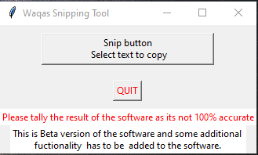

# Extract Data by Snipping

* This program enables the user to select an area on the screen 
 * The text is then extracted from the  screenshot to the clipboard (it is copied).
 * The user can then easily paste that information wherever it  is required.

<h2 align="center">Program Screenshot 
  
</h2>
